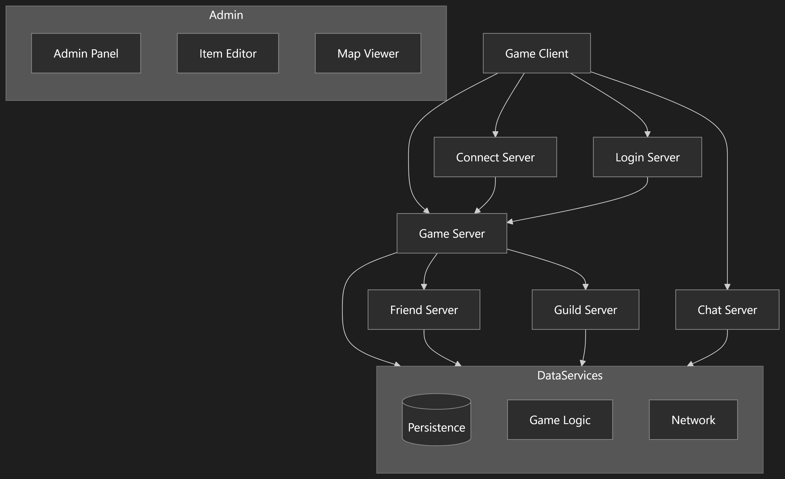
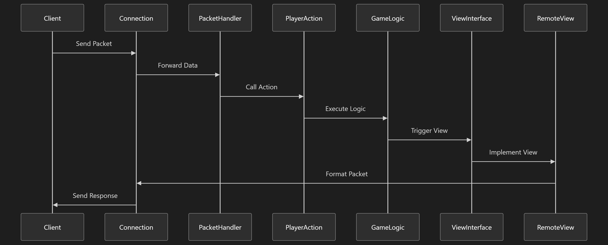
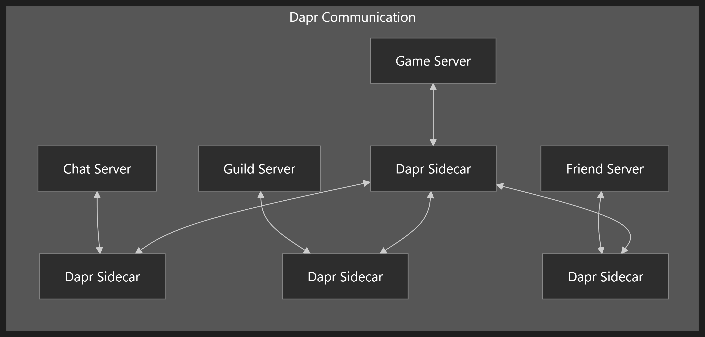

# OpenMU: A Comprehensive Architecture Overview

## Introduction

OpenMU is an open-source implementation of a server for the MMORPG "MU Online" developed in C# .NET. The project demonstrates a modern approach to game server architecture, employing microservices, clean separation of concerns, and flexible deployment options. This article provides a detailed overview of the system's architecture, communication patterns, data management, and key implementation details.

## High-Level Architecture

OpenMU follows a microservices-based architecture that can be deployed either as a monolith or as distributed services. The system is composed of several specialized servers that handle different aspects of gameplay, with core service layers providing the fundamental functionality needed across these servers.

## Server Components in Detail

### Game Server
The Game Server is the central component that manages the game world, player actions, and NPC behavior. It processes player inputs, handles game mechanics, and coordinates communication with other specialized servers. The Game Server is responsible for:

- Player movement and interactions
- Combat and skill systems
- Item management and inventory
- Quest progression
- Game world state management
- Coordinating with specialized servers (Friend, Guild, etc.)

### Connect Server
The Connect Server is the entry point for game clients, managing initial connections and redirecting clients to appropriate game servers. It provides load balancing by distributing players across available game servers and acts as a gateway to the game ecosystem.

### Login Server
The Login Server handles authentication and character management, including:
- Account verification
- Character selection, creation, and deletion
- Initial character data loading

### Chat Server
The Chat Server manages all communication between players, supporting:
- Public chat in game maps
- Private whispers between players
- Chat rooms
- Guild chat

### Guild Server
The Guild Server handles all guild-related operations:
- Guild creation and management
- Member roles and permissions
- Guild wars and alliances
- Guild-specific features

### Friend Server
The Friend Server manages social connections between players:
- Friend lists
- Friend status notifications
- Memo/message system between friends

## Core Service Layers

### Data Model
The Data Model layer defines the domain entities and data structures used throughout the system. It provides a shared understanding of game concepts like:
- Characters, skills, and attributes
- Items and inventories
- Maps and game world structure
- Configuration settings

This layer is implementation-agnostic, focusing on modeling the game domain accurately.

### Game Logic
The Game Logic layer contains the rules, algorithms, and mechanics that drive the gameplay:
- Combat calculations and damage formulas
- Skill effects and buffs
- Character progression systems
- NPC behavior and AI
- Quest conditions and rewards

This layer is designed to be independent of network protocols or persistence mechanisms, focusing purely on game mechanics.

### Network
The Network layer handles all communication protocols between clients and servers, including:
- Packet definitions and structures
- Encryption and security
- Connection management
- Serialization and deserialization of data

The implementation follows a clean separation between communication concerns and game logic.

### Persistence
The Persistence layer manages data storage and retrieval, supporting multiple implementation options:
- Entity Framework Core with PostgreSQL (primary)
- In-memory storage (for testing)
- Optimized query generation for complex data

## Communication Architecture

### Client-Server Communication

The communication between game clients and the server follows a clear separation of concerns:

1. **Incoming (Client → Server)**:
   - Data packets from clients are received by the `Connection` class
   - Forwarded to appropriate `PacketHandlers` in the GameServer.MessageHandler namespace
   - Handlers parse the packet data and call corresponding actions in the GameLogic.PlayerActions namespace
   - Actions implement the game logic without knowledge of the network protocol

2. **Outgoing (Server → Client)**:
   - Game events trigger calls to view interfaces in GameLogic.Views
   - Specific implementations in GameServer.RemoteView convert these into protocol-specific packets
   - The `Connection` class sends the formatted data to clients

This architecture allows the game logic to remain completely isolated from the details of the network protocol, promoting maintainability and flexibility.

### Inter-Service Communication

Services communicate through well-defined interfaces in the `Interfaces` project. In the distributed deployment model, Dapr (Distributed Application Runtime) facilitates service discovery and communication:

- Each service has a Dapr sidecar handling communication
- Service-to-service calls are abstracted through Dapr's APIs
- State management and resiliency patterns are provided by Dapr

## Data Management and Persistence

The persistence layer follows a context-based approach that supports flexible data storage strategies:

### Context-Based Data Access
- Game configuration is loaded at server startup through a `GameConfigurationRepository`
- Each connected player is assigned a `PlayerContext` for loading/saving account data
- Contexts manage the lifecycle of persistent objects and track changes

### Repository Pattern
- Abstractions for data access are defined in the `Persistence` namespace
- Concrete implementations can target different database technologies
- Currently implemented primarily with Entity Framework Core and PostgreSQL

### Optimization for Complex Data
- The game configuration contains complex relationships and hierarchies
- Optimized using dynamically generated queries that return data as JSON
- This approach balances relational integrity with performance

### Future Extensibility
The architecture supports potential future options like:
- Document databases for specific data types
- Mixed storage strategies (relational + document)
- Custom optimized data access for high-performance scenarios

## Game Mechanics Implementation

### Game Map System

The game map implementation uses an innovative "bucket map" approach to efficiently handle large numbers of objects:

- Each map of 256×256 coordinates is divided into "buckets" (e.g., 8×8 areas)
- Players observe nearby buckets rather than individual objects
- When objects enter or leave a bucket, all observers are notified
- This reduces the computational complexity from O(n²) to a much more manageable level

This design specifically addresses performance challenges in MMO games where hundreds or thousands of players might congregate in a single area (e.g., castle sieges).

### Master Skill System

The Master Skill system exemplifies how game mechanics are implemented:

- Characters reaching level 400 can change to a master class
- The master skill tree has three roots with up to 5 ranks
- Skills can be passive (stat bonuses) or active (enhanced abilities)
- Character-specific skill availability and requirements
- Implementation divided between data model, game logic, and client communication

## Plugin Architecture and Extensibility

OpenMU employs a plugin architecture that allows for extensive customization without modifying core functionality:

### View Plugins
- Game events trigger calls to view interfaces
- Multiple implementations can target different client versions
- New visualizations can be added without changing game logic

### Packet Handler Plugins
- Process incoming data from clients
- Can be customized for different protocol versions
- Activated/deactivated through the Admin Panel

### Server Configuration
- Each game server can have multiple TCP listeners
- Different ports can support different client versions
- Plugin configurations can be tailored per server instance

## Deployment Models

The project supports multiple deployment options to accommodate different needs:

### All-in-One (Monolithic)
- All servers run within a single process
- Simplifies deployment and development
- Suitable for smaller installations or development environments

### Distributed (Microservices)
- Each server runs as an independent service
- Uses Dapr for service discovery and communication
- Allows for horizontal scaling of specific components
- More complex but offers greater scalability

### Docker Support
- Container-based deployment for both models
- Docker Compose files for easy orchestration
- Options for development and production environments

## Web-based Tools and Interfaces

OpenMU includes several web-based tools for administration and management:

### Admin Panel
- Comprehensive administration interface
- Server configuration and monitoring
- User and character management
- Game configuration editing

### Item Editor
- Visual tool for creating and modifying game items
- Attribute and appearance configuration
- Item drop and acquisition settings

### Map Viewer
- Visual representation of game maps
- NPC and monster placement
- Environment configuration

These web interfaces are built using modern web technologies and provide a user-friendly way to manage the game server.

## Development and Testing Approach

The project follows modern software development practices:

- Comprehensive unit and integration tests
- Clear separation of concerns for testability
- In-memory implementations for testing without external dependencies
- Code style enforcement through analyzers

## Conclusion

OpenMU represents a modern, well-architected implementation of a game server, demonstrating best practices in software design. Its microservices approach, clean separation of concerns, and flexible deployment options make it both an educational project and a practical platform for running MU Online servers.

The architecture prioritizes:
- Modularity and extensibility
- Performance optimization for MMO-specific challenges
- Clear boundaries between system components
- Flexible deployment options

Whether deployed as a monolith or as distributed services, the system maintains the same logical architecture, allowing for seamless transitions between deployment models as needs evolve.